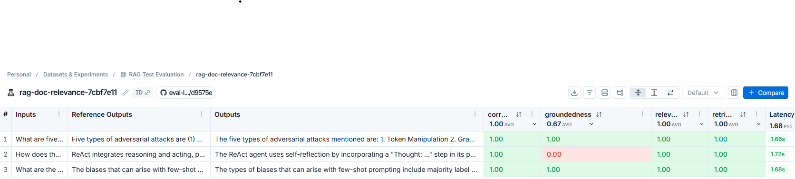

# eval-llmasjudge-rag

**LLM-as-a-Judge evaluation harness for a Retrieval-Augmented Generation (RAG) pipeline.**

This project builds a small RAG chatbot over Lilian Weng's blog posts (LLM agents, prompt
engineering, and adversarial attacks) and then **evaluates the quality of its answers
automatically** using four LLM-as-a-judge evaluators, orchestrated and tracked through
[LangSmith](https://smith.langchain.com).

---

## Table of Contents

- [What It Does](#what-it-does)
- [Application Flow](#application-flow)
- [The Four Evaluators](#the-four-evaluators)
- [Project Structure](#project-structure)
- [Key Components](#key-components)
- [Sample Inputs & Outputs](#sample-inputs--outputs)
- [Evaluation Results](#evaluation-results)
- [Setup & Installation](#setup--installation)
- [Running the App](#running-the-app)
- [Configuration](#configuration)

---

## What It Does

A typical RAG system answers questions by retrieving relevant document chunks and feeding
them to an LLM. But **how do you know if the answers are any good?** This project answers
that question by scoring every generated answer on four independent dimensions:

| Dimension | Question it answers | Needs a reference answer? |
|---|---|---|
| **Correctness** | Is the answer factually right vs. the ground truth? | ✅ Yes |
| **Groundedness** | Is the answer supported by the retrieved docs (no hallucination)? | ❌ No |
| **Relevance** | Does the answer actually address the user's question? | ❌ No |
| **Retrieval Relevance** | Were the retrieved documents relevant to the question? | ❌ No |

Each evaluator is itself an LLM (`gpt-4o`, temperature `0`) prompted as a "teacher grading a
quiz" and forced to return a **typed, structured verdict** (a boolean + an explanation) via
`with_structured_output(...)`.

---

## Application Flow

```
                        ┌─────────────────────────────────────────────┐
                        │  1. DATA INGESTION  (dataingetion.py)         │
                        │  Create LangSmith dataset "RAG Test           │
                        │  Evaluation" with question + reference        │
                        │  answer examples.                             │
                        └───────────────────────┬─────────────────────┘
                                                 │
                                                 ▼
   ┌──────────────────────────────────────────────────────────────────────────┐
   │  2. RAG SETUP  (raggeneration.py · rag_uploader)                           │
   │  • Load 3 Lilian Weng blog posts via WebBaseLoader                         │
   │  • Split into 250-token chunks (no overlap)                                │
   │  • Embed with OpenAIEmbeddings → InMemoryVectorStore                       │
   │  • Expose as a retriever (top-k = 6)                                       │
   └───────────────────────────────────┬──────────────────────────────────────┘
                                        │
                                        ▼
   ┌──────────────────────────────────────────────────────────────────────────┐
   │  3. EVALUATION RUN  (bindeval.py · evaluaterag)                            │
   │  LangSmith client.evaluate(...) iterates over every dataset example:       │
   │                                                                            │
   │   for each example:                                                        │
   │     inputs ──► target() ──► rag_bot(question)                              │
   │                              │                                             │
   │                              ├─ retriever.invoke(question) → documents     │
   │                              └─ llm.invoke(system+question) → answer       │
   │                              ▼                                             │
   │              outputs = {"answer": ..., "documents": [...]}                 │
   │                              │                                             │
   │     outputs + inputs + reference_outputs ──► 4 evaluators                  │
   └───────────────────────────────────┬──────────────────────────────────────┘
                                        │
                                        ▼
   ┌──────────────────────────────────────────────────────────────────────────┐
   │  4. SCORING  (the four *gradellm.py evaluators)                            │
   │  Each evaluator (gpt-4o, temp 0) returns {explanation, <bool verdict>}.    │
   │  Results stream to LangSmith under experiment "rag-doc-relevance".         │
   └────────────────────────────────────────────────────────────────────────────┘
```

### How `outputs` is populated

The RAG bot's return value **is** the `outputs` dict that every evaluator receives:

```python
# raggeneration.py — rag_bot()
return {"answer": ai_msg.content, "documents": docs}
```

LangSmith's `evaluate()` is the glue: it runs `target(inputs)` → `rag_bot(question)`, captures
the returned dict, and passes it as the `outputs` argument to each evaluator. That is why an
evaluator can reference `outputs['answer']` (the generated answer) and `outputs['documents']`
(the retrieved chunks).

---

## The Four Evaluators

All evaluators share the same pattern: a `gpt-4o` grader LLM at `temperature=0`, a "teacher
grading a quiz" system prompt, and a `TypedDict` schema that forces an `explanation` field
**before** the boolean verdict (so the model reasons before it decides).

### 1. Correctness — `correctnessgradellm.py`
Compares the generated answer against the **ground-truth reference answer**.
- **Inputs used:** `inputs['question']`, `reference_outputs['answer']`, `outputs['answer']`
- **Returns:** `correct: bool`
- Tolerates extra information as long as it doesn't conflict with the ground truth.

### 2. Groundedness — `groundedgradellm.py`
The **hallucination detector**. Checks whether the answer is supported by the retrieved docs.
- **Inputs used:** `outputs['documents']` (as FACTS), `outputs['answer']` (as STUDENT ANSWER)
- **Returns:** `grounded: bool`
- No reference answer required.

### 3. Relevance — `relevancegradellm.py`
Checks whether the answer actually addresses the user's question (helpfulness).
- **Inputs used:** `inputs['question']`, `outputs['answer']`
- **Returns:** `relevant: bool`
- No reference answer required.

### 4. Retrieval Relevance — `retrievalrelevancegradellm.py`
Checks whether the **retrieved documents** were relevant to the question (retriever quality).
- **Inputs used:** `outputs['documents']` (as FACTS), `inputs['question']`
- **Returns:** `relevant: bool`
- No reference answer required.

---

## Project Structure

```
eval-llmasjudge-rag/
├── README.md
├── requirements.txt
├── .env                          # API keys (not committed)
└── app/
    ├── main.py                       # Entry point: loads env, runs evaluation
    ├── config.py                     # Pydantic-settings config (validated, cached)
    ├── dataingetion.py               # Builds the LangSmith eval dataset
    ├── raggeneration.py              # The RAG pipeline (retriever + rag_bot)
    ├── bindeval.py                   # Wires target + 4 evaluators into client.evaluate
    │
    ├── correctnessgradellm.py        # Evaluator: correctness  (vs. reference)
    ├── groundedgradellm.py           # Evaluator: groundedness (hallucination)
    ├── relevancegradellm.py          # Evaluator: answer relevance
    ├── retrievalrelevancegradellm.py # Evaluator: retrieval relevance
    │
    ├── correctnessgrade.py           # TypedDict schema: {explanation, correct}
    ├── groundedgrade.py              # TypedDict schema: {explanation, grounded}
    ├── relevancegrade.py             # TypedDict schema: {explanation, relevant}
    ├── retrievalrelevancegrade.py    # TypedDict schema: {explanation, relevant}
    │
    └── docs/
        └── RAG_Test_Evaluation_Restuls.png   # Sample LangSmith results screenshot
```

---

## Key Components

### `main.py` — Entry Point
Loads `.env`, sets the LangSmith / OpenAI environment variables and `LANGSMITH_TRACING=true`,
then constructs `bindeval()` and calls `evaluaterag()`.

### `config.py` — Configuration
A `pydantic-settings` `Settings` class that loads and **type-validates** all configuration
from environment variables / `.env`. Exposed through a cached `get_settings()` singleton. The
app fails fast at startup if `OPENAI_API_KEY` is missing.

### `dataingetion.py` — Dataset Builder
Creates the LangSmith dataset **`RAG Test Evaluation`** with three hand-written examples (each
a `question` + a ground-truth `answer`). Run this **once** to seed the dataset before
evaluating. Also logs a partially-masked view of the loaded API keys for sanity checking.

### `raggeneration.py` — The RAG Pipeline
- `rag_uploader()` — loads the 3 blog posts, chunks them (250 tokens, no overlap), embeds with
  `OpenAIEmbeddings`, and builds an `InMemoryVectorStore` retriever (`k=6`).
- `rag_bot(question)` — the `@traceable`-decorated bot: retrieves context, injects it into the
  system prompt, calls `gpt-4o-mini`, and returns `{"answer", "documents"}`.

### `bindeval.py` — Evaluation Orchestrator
Instantiates the RAG pipeline + all four evaluators, defines `target(inputs)` (the function
LangSmith calls per datapoint), and runs `client.evaluate(...)` under the experiment prefix
`rag-doc-relevance`.

---

## Sample Inputs & Outputs

### Dataset examples (inputs + reference answers) — from `dataingetion.py`

| # | Question (input) | Ground-truth reference answer |
|---|---|---|
| 1 | *How does the ReAct agent use self-reflection?* | ReAct integrates reasoning and acting, performing actions — such as tools like Wikipedia search API — and then observing / reasoning about the tool outputs. |
| 2 | *What are the types of biases that can arise with few-shot prompting?* | (1) Majority label bias, (2) Recency bias, and (3) Common token bias. |
| 3 | *What are five types of adversarial attacks?* | (1) Token manipulation, (2) Gradient based attack, (3) Jailbreak prompting, (4) Human red-teaming, (5) Model red-teaming. |

### Example of what flows through the system

**Input to `target`:**
```python
{"question": "What are five types of adversarial attacks?"}
```

**Output from `rag_bot` (becomes `outputs`):**
```python
{
  "answer": "The five types of adversarial attacks mentioned are: 1. Token Manipulation 2. Gradient-based attacks ...",
  "documents": [Document(page_content="..."), ...]   # 6 retrieved chunks
}
```

**Verdict from an evaluator (e.g. correctness):**
```python
{
  "explanation": "The student answer lists the same five attack types as the ground truth...",
  "correct": True
}
```

---

## Evaluation Results

A sample evaluation run, as shown in the LangSmith experiment view:



Reading the table: each row is a dataset example with its inputs, reference output, and the
RAG bot's actual output, scored across **correctness**, **groundedness**, **relevance**, and
**retrieval relevance** (plus latency). In this run, groundedness averaged `0.67` — one
answer (the ReAct self-reflection question) was judged **not fully grounded** in the retrieved
documents even though it was correct, relevant, and used relevant retrieval. This is exactly
the kind of insight the harness surfaces: an answer can be *correct* yet not strictly
*grounded* in what was retrieved.

---

## Setup & Installation

### Prerequisites
- Python 3.10+
- An **OpenAI API key** (required)
- A **LangSmith API key** (for dataset creation + tracking the evaluation)

### Install

```powershell
# from the project root
python -m venv .venv
.\.venv\Scripts\Activate.ps1
pip install -r requirements.txt
```

### Configure environment

Create a `.env` file in the project root:

```dotenv
OPENAI_API_KEY=sk-...
LANGSMITH_API_KEY=ls-...
LANGSMITH_TRACING=true
LANGSMITH_PROJECT=evals
# optional
GROQ_API_KEY=
```

---

## Running the App

### 1. Create the evaluation dataset (one-time)

The dataset must exist in LangSmith before you evaluate. Seed it via `dataingetion.py`:

```powershell
cd app
python -c "from dataingetion import dataingetion; dataingetion().prepare_rag_evaldata()"
```

> ⚠️ `create_dataset` will error if a dataset named **`RAG Test Evaluation`** already exists —
> run this step only once (or delete the existing dataset first).

### 2. Run the evaluation

```powershell
cd app
python main.py
```

This builds the retriever, runs the RAG bot over every dataset example, scores each answer
with the four evaluators, and pushes results to LangSmith under the `rag-doc-relevance`
experiment. Open the experiment in the LangSmith UI to view the scored table (as pictured
above).

---

## Configuration

All settings are centralised in `config.py` (`pydantic-settings`) and read from environment
variables / `.env` (case-insensitive):

| Setting | Env var | Default | Notes |
|---|---|---|---|
| OpenAI API key | `OPENAI_API_KEY` | — | **Required** |
| Groq API key | `GROQ_API_KEY` | `None` | Optional |
| LangSmith API key | `LANGSMITH_API_KEY` | `None` | Needed for datasets + tracking |
| LangSmith tracing | `LANGSMITH_TRACING` | `false` | Set `true` to trace runs |
| LangSmith project | `LANGSMITH_PROJECT` | `evals` | |
| LangSmith endpoint | `LANGSMITH_ENDPOINT` | `https://api.smith.langchain.com` | |
| Default model | — | `gpt-4o-mini` | RAG generation model |
| Temperature | — | `0.0` | |
| Log level | — | `INFO` | |

### Models used
- **RAG generation:** `gpt-4o-mini` (`raggeneration.py`)
- **Embeddings:** `OpenAIEmbeddings` (default model)
- **All four judge/evaluator LLMs:** `gpt-4o`, `temperature=0`

---

## Design Notes

- **Structured output everywhere.** Every evaluator uses
  `with_structured_output(Schema, method="json_schema", strict=True)` so verdicts are reliably
  parseable booleans, never free text.
- **Explanation before verdict.** In each `TypedDict` schema, `explanation` is declared before
  the boolean field. Since the model generates fields in declaration order, this forces it to
  reason before committing to a score — improving judgment quality.
- **Reference-free where possible.** Three of the four evaluators (groundedness, relevance,
  retrieval relevance) need no ground-truth answer, so they can score live production traffic,
  not just curated datasets.
